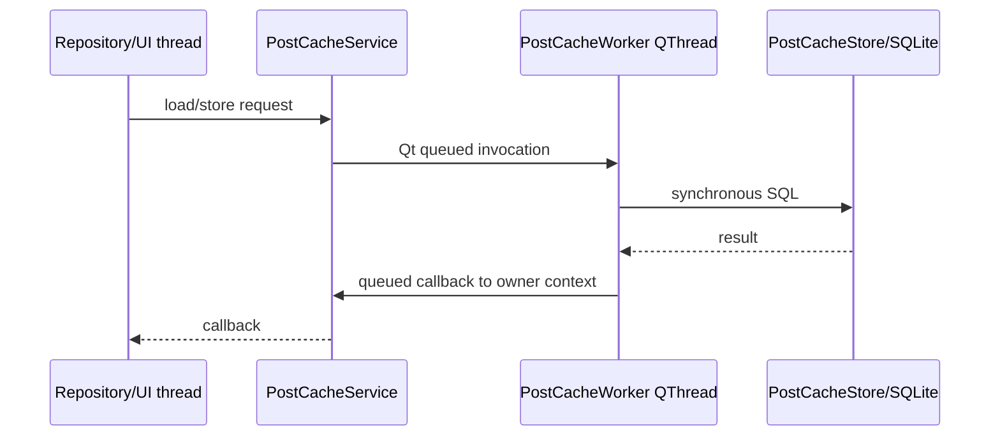
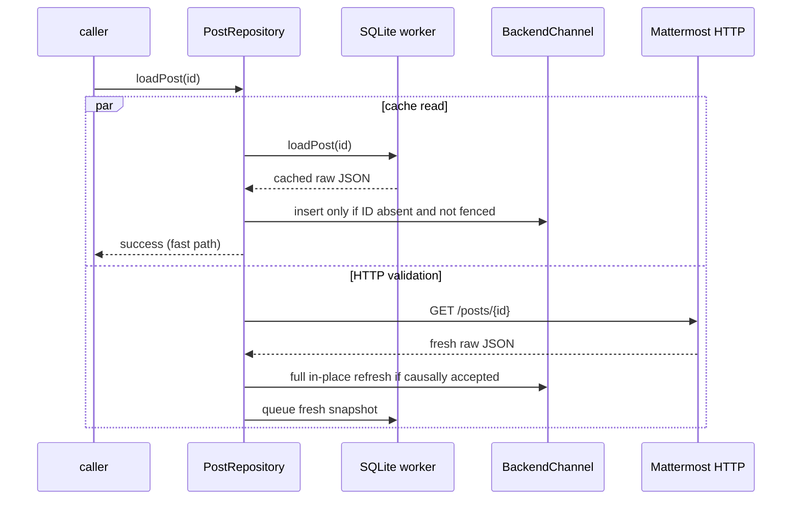

# Post cache runtime: loading and paging

> Part of [Post cache runtime contract](../post-cache-runtime.md). Read the landing page first and load this file only when this area is relevant.

## Asynchronous cache service

`PostCacheStore` is synchronous and thread-confined. `PostCacheService` exposes queued operations and
marshals read callbacks back to its owner thread.



On normal destruction, the service drains earlier queued writes, performs final maintenance, destroys
the SQL connection on its owning worker thread, then joins the thread. A crash may lose cache warming,
but never represents loss of unsent user/server state because the cache is disposable.

## Direct cache-first `loadPost()`

Direct lookup is conservative:

- SQLite and HTTP start independently;
- the first successful source may satisfy the caller;
- HTTP validation is always dispatched even after a cache hit;
- cached data may insert an **absent** resident identity;
- cached data never refreshes an already-resident post;
- a newer resident mutation observed after the cache read began vetoes that cached insertion;
- HTTP uses normal resident causal fencing and may refresh the cached object in place;
- failure is delivered only after both cache and HTTP have failed/missed.



The logical callback is invoked once. The later HTTP validation can still refresh resident/cache state
without becoming a second caller result.

## Why cached data cannot refresh resident data

Suppose a resident post has already received a WebSocket edit while an older SQLite read finishes
later. SQLite carries no cross-process/server revision guarantee strong enough to overwrite that state.
The rule is therefore stronger than sequence comparison:

> cache reads can fill absence, but never overwrite presence.

Only server observations (HTTP/full WebSocket snapshots) refresh resident objects.

## Newest-window hydration contract

Bounded newest-window hydration is enabled for channels with a logical count estimate and for threads.
It consumes only provenance-backed tail windows; arbitrary cached rows never become a range.

### Channel

A cached contiguous tail window may give an immediate first paint, but SQLite does not know whether
remote traffic changed the current newest edge. The source requires the cached newest root timestamp
to match current `last_root_post_at`; otherwise those snapshots remain ordinary cached bodies and are
not mapped as the current suffix. `last_post_at` is not sufficient because a thread reply advances
general channel activity without changing the root-post timeline. Older server payloads that omit
`last_root_post_at` use the existing compatibility fallback in `BackendChannel`.

A matching cached window is still only a **newest-aligned provisional suffix**:

```text
logical estimate
[ ? ? ? ? ? | cached newest IDs ]
                  provisional
```

The source immediately asks the server for authoritative newest-edge data. With current demand-aware
loading this is normally one `page=0` request sized for the needed tail window, not a mandatory series
of ten-post pages. Once exact identities exist, sequential expansion uses `before`/`after` cursors.
Server overlap upgrades/replaces the provisional suffix without moving viewport ownership out of
`LongListWidget`.

A cached suffix must never manufacture newest-edge or cursor authority merely from timestamps.

### Thread

A provenance-backed thread window contains a bounded ordered set of recent replies. The source
requires its newest cached reply timestamp to match the root's current `last_reply_at`, then publishes
those IDs provisionally into tail slots. Provisional IDs may paint, but they are not authoritative
thread cursors. A normal exact tail/initial HTTP request validates the window and upgrades/replaces its
placement.

The shared `IndexedPostSource` only mutates identities after a concrete source decides whether a
placement is exact or provisional.

### Stable identity versus resident availability

The resident cache keeps logical source IDs after their `BackendPost` body is evicted. Therefore two
state changes remain independent:

```text
identity mapping changes
    -> itemsChanged / structural slot signals

identity unchanged, resident body rematerialized
    -> availability/rematerialization notification only
```

An identical authoritative response can leave identity mapping unchanged while restoring missing
bodies. `BackendChannel::onPostBodyAvailabilityChanged` ->
`IndexedPostSource::bodyAvailabilityChanged` is the separate rematerialization path.

## Channel paging authority

`total_msg_count_root` is an initial coordinate estimate, not `/posts` visible row count. Count-excluded
system roots such as join/leave can make visible history longer than the counter; soft-deleted ordinary
roots remain represented in the historical counter while disappearing from normal visible history and
can make it shorter. Consequently ordinary scrolling should stop depending on absolute page arithmetic
as soon as exact identities are available.

Current authority order is:

```text
demand reaches known newest edge
    -> page=0 with per_page sized for contiguous demand (minimum transport chunk still allowed)

known authoritative neighbour
    -> before(postId) / after(postId)

disconnected random position
    -> absolute page/context machinery

uncertain oldest edge
    -> absolute-page probes/reconciliation
```

Absolute `/posts` pages remain the right evidence for oldest-boundary count repair and disconnected
page placement. They are no longer the only valid channel placement proof: a server `before`/`after`
response adjacent to an authoritative post identity proves its exact neighbouring logical window.

SQLite participates in none of these proofs. Cached identities may accelerate first paint or semantic
navigation, but only endpoint-specific server evidence establishes exact placement.

## Thread paging authority

Thread topology is separate from channel count repair:

```text
index 0      root
1..N         replies oldest -> newest
```

`Thread.ReplyCount` excludes deleted replies and normally gives the visible logical reply count. Thread
transport uses `(fromCreateAt, fromPost, direction)` rather than channel absolute page numbers.
Exact placement comes from the root/initial edge, tail edge, or adjacency to a known compound cursor.
Timestamp approximation is only a seed for a genuinely disconnected middle seek and must not become
an authoritative mapping without server overlap/boundary evidence.

Live replies are resident/server observations and can extend the logical tail immediately. Root summary
updates normally reserve the new reply-count slot before `onNewPost(reply)` fills it; the reply must not
be counted twice.

## Source logical attachment versus HTTP coalescing

Two different optimizations operate at different layers:

1. `PostSourceRequestGate` may attach overlapping or immediately adjacent **logical range waiters** to
   one exact in-flight edge/cursor request. The gate never expands its promised coverage and never
   creates a FIFO transport queue. Distant demand from fast scrolling can start independently.
2. `PostRepository::coalescedGet()` combines **physically identical HTTP requests**. Its observation
   sequence belongs to that one physical request and is shared by all callbacks.

These mechanisms must not be merged. The source knows logical indices, edge authority and current
demand; the repository knows URLs/physical requests and causal sequencing.

When a source request finishes, attached logical waiters are released and `LongListWidget` recomputes
what the *current* viewport still needs. It is intentionally possible for old fast-scroll demand to
become irrelevant without being executed as a queued transport chain.
