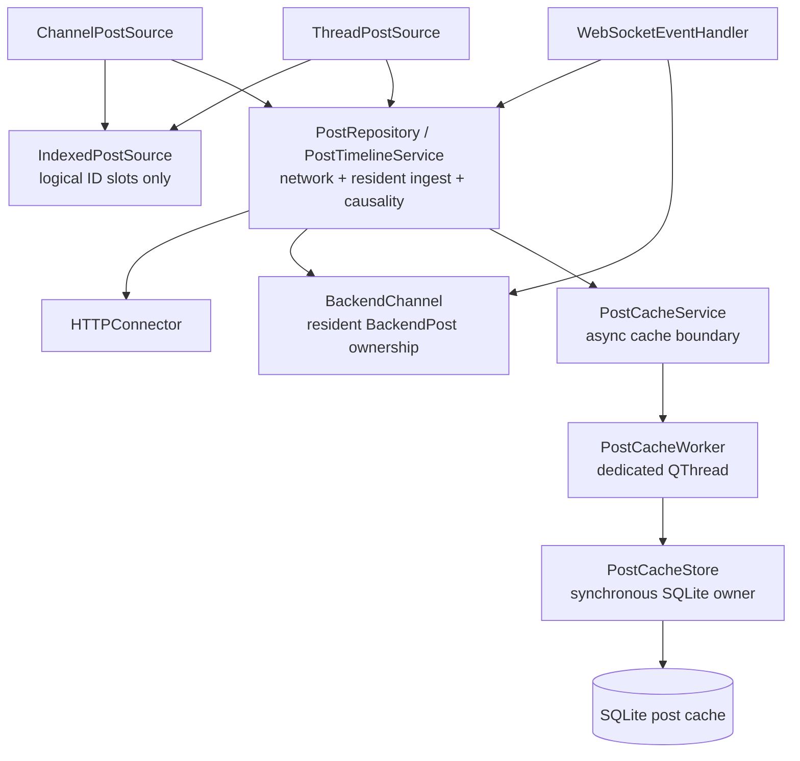
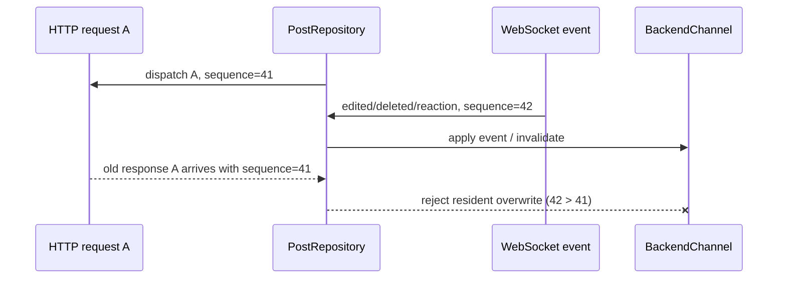
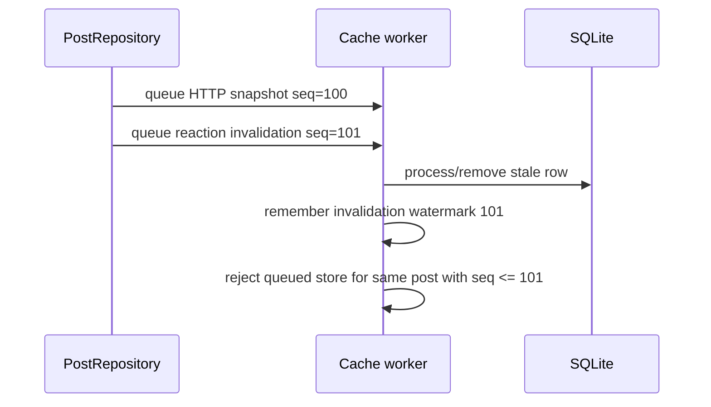

# Post cache runtime: snapshots and causality

> Part of [Post cache runtime contract](../post-cache-runtime.md). Read the landing page first and load this file only when this area is relevant.

## Components and ownership



The ownership rules are strict:

- `BackendChannel` owns resident `BackendPost` objects;
- post sources own logical **post IDs and slots**, never durable raw post ownership;
- concrete post sources own logical demand planning (edge/cursor/disconnected seek and short-lived
  request attachment);
- `PostRepository` owns physical HTTP request coalescing, snapshot ingest and resident causality;
- `PostCacheService` owns asynchronous transfer to/from the cache worker;
- `PostCacheStore` owns the SQLite connection and all synchronous SQL;
- only the worker thread touches `PostCacheStore`/`QSqlDatabase`;
- `LongListWidget` and `ChatLogWidget` never access SQLite directly.

This separation allows resident eviction/rematerialization without changing source identity and keeps
viewport demand distinct from physical transport coalescing.

## Snapshot authority model

Not every observation has the same authority. There are two independent questions:

1. **payload freshness** — is this post snapshot newer than another snapshot?
2. **timeline placement** — does this observation prove a logical index/edge/cursor/page boundary?

Those must never be conflated.

| Observation | Payload authority | Timeline-placement authority |
| --- | --- | --- |
| successful current HTTP post/page/thread response | authoritative subject to causal fence | yes, only for the endpoint-specific edge/cursor/page fact it proves |
| WebSocket `posted` / `post_edited` full post object | authoritative subject to event order | live identity/content only; no arbitrary historical adjacency |
| WebSocket delete/reaction-only event | authoritative mutation/invalidation | no historical placement authority |
| resident `BackendPost` | current accepted in-process state | only the source's current ID mapping has placement authority |
| SQLite raw post snapshot | provisional/stale-capable | **never** proves channel/thread adjacency by itself |

A cache hit can therefore make a post immediately displayable without proving where arbitrary
historical neighbors belong.

## Raw snapshot representation

Persistent storage keeps compact Mattermost post JSON rather than a second normalized C++ schema.
Only fields required for lookup, ordering and eviction are duplicated into SQLite post columns:

```text
post_id
channel_id
root_id
create_at
update_at
last_access
compressed raw JSON payload
```

A separate `tail_windows` table records ordered IDs from server responses that actually proved a
newest edge. This provenance is essential: individually cached rows do not form a contiguous window.
Direct lookups, reaction invalidation and LRU eviction can all create holes. Window reads therefore
return only a newest still-complete suffix after the last missing/corrupt row.

Client-only annotations such as `_mmqt_sender_name` and `_mmqt_current_user_mentioned` are transient.
When a raw REST/cache refresh omits them, in-place refresh preserves already-known local annotation
state. Poll vote/admin metadata is also preserved when rebuilding a post-backed poll from a snapshot
that does not contain those separately fetched fields.

## Stable resident object refresh

Widgets and existing code may temporarily hold a `BackendPost*`. A fresh HTTP snapshot must therefore
not replace an already-resident object merely to refresh its contents.

```text
fresh accepted raw JSON
        |
construct temporary parsed BackendPost
        |
validate immutable identity/topology
        |  id / channel_id / root_id / create_at must match
        v
replace server-backed mutable fields in existing object
        |
preserve object address
        |
emit onPostEdited only if observable state changed
```

Fields refreshed include message/edit/delete timestamps, pin state, author, props, attachments/files,
reactions, thread metadata and poll definition.

## Observation sequence and resident causality

Arrival time is not freshness. A physical HTTP request can start before a WebSocket mutation and
finish after it:



`PostRepository` maintains a monotonic per-backend observation sequence:

- a **physical** HTTP request captures one sequence when dispatched;
- all callers coalesced onto that request share the same sequence;
- every WebSocket post mutation captures a newer sequence when observed;
- resident watermarks are stored per post ID;
- replies conservatively advance the root ID watermark too because reply ingest may modify root
  thread metadata.

Before resident ingest, each post in an HTTP response is checked against the resident watermark. A
post shadowed by a newer observation is dropped from resident ingest while unrelated posts in the same
response remain usable. Resident watermarks are short-lived in-flight causality guards, not durable
server version metadata.

## Disk write causality

The cache worker has an independent invalidation fence because durable commands execute later on a
separate thread.



Delete and reaction-only events invalidate regardless of channel admission. A cold channel is not a
reason to retain a row already known to be stale.

The resident and disk fences solve different races:

- resident fence prevents stale network work from overwriting visible in-process state;
- worker fence prevents stale queued writes from resurrecting durable rows.

Neither fence makes SQLite authoritative.

## Account isolation across asynchronous work

Every queued cache operation contains the complete account key captured when the operation is created:

```text
(normalized server URL, Mattermost user id)
```

The worker resolves/selects the integer SQLite `account_id` immediately before executing that command.
There is no mutable caller-thread "current cache account" shared by queued work. A response dispatched
for account A therefore remains in A's namespace even if account B becomes current before its callback
or worker command runs.

## Channel interest and admission

Full post payloads are expensive. Live membership/activity does not imply user interest.

Admission is normally based on **channel opened time**:

```text
opened within memory horizon (default 1 h)
    -> eligible for general resident post retention

opened within disk horizon (default 10 h)
    -> eligible for SQLite writes/retention

outside horizons
    -> metadata/unread/notification processing only
```

Opening a thread records a parent-channel open at that moment. Incoming traffic does not refresh either
horizon; otherwise a busy unread channel could keep itself hot indefinitely.

There is one precise resident exception. An open `ThreadPostSource` holds a `PostResidencyLease` on its
root. If the parent channel later becomes memory-cold, a WebSocket `posted` reply whose `root_id`
matches that leased root is still inserted into `BackendChannel` and delivered through
`channel.onNewPost`. The open thread already expresses active body interest and must receive the reply
that the server has delivered.

The exception is deliberately narrow:

- it does not make the whole parent channel memory-hot;
- unrelated roots/replies in that cold channel remain transient;
- it does not update channel-open time;
- it does not bypass the separate disk-admission horizon.

WebSocket observations still advance resident causality even when their post body is not admitted.
Durable admission is always evaluated separately.
