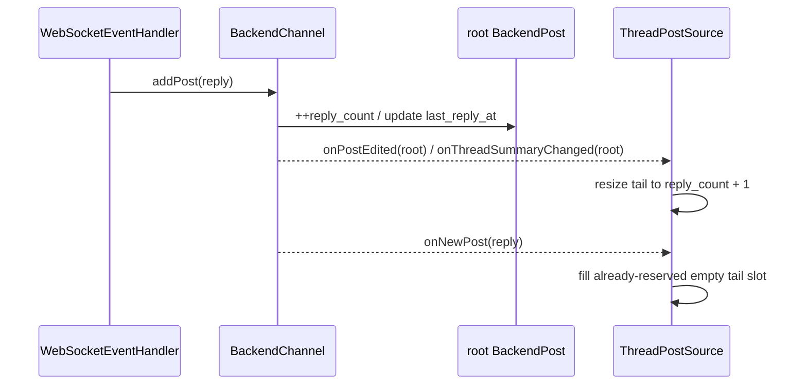

# Post sources: channel and thread sources

> Part of [Post source architecture](../post-source-architecture.md). Read the landing page first and load this file only when this area is relevant.

## Channel source

`ChannelPostSource` maps ordinary channel roots onto oldest-to-newest logical indices. Mattermost
`/channels/{id}/posts` still provides newest-anchored absolute pages, but absolute page arithmetic is
no longer the primary path for ordinary scrolling.

The normal loading order is:

```text
known newest edge + demand touches tail
        -> page=0, per_page sized for the contiguous demand (with a small minimum)

known authoritative neighbour
        -> before(postId) / after(postId)

disconnected random window
        -> absolute page / navigation-context machinery

oldest edge with uncertain total count
        -> absolute-page boundary repair
```

Once an authoritative identity is available next to a gap, its `before`/`after` cursor is stronger
than a page number derived from the approximate channel row count. Sequential wheel scrolling should
therefore remain on exact identities even when `total_msg_count_root` differs from the number of rows
returned by `/posts`.

Transport-specific responsibilities that stay in `ChannelPostSource` include:

- using page zero as the exact newest-edge bootstrap;
- exact placement immediately before/after known root-post identities;
- converting disconnected/random logical positions to absolute Mattermost pages when no cursor is
  available;
- interpreting `total_msg_count_root` only as an initial estimate;
- symmetric oldest-boundary repair when that estimate is too large or too small;
- one-root distant boundary probes, exponential search and bounded binary search;
- preserving newest-page mapping while count growth/shrink changes the oldest prefix;
- provisional semantic navigation windows and adoption when authoritative context later intersects
  them;
- unknown-count compatibility mode when `total_msg_count_root` is absent.

### Channel count topology

A channel count correction preserves the **newest edge**:

```text
estimate too small                     estimate too large

[ newest known rows ]                   [ phantom ][ real rows ]
        ^                                         |
        | add empty prefix                         | remove prefix
        |                                         v
[ ? ? ? | newest known rows ]            [ real rows ]
```

This is why channel count repair uses prefix insertion/removal rather than the generic tail resize.
The proof of the corrected count remains channel-specific: only server boundary evidence from `/posts`
has that authority.

`total_msg_count_root` is not the visible `/posts` row count. Count-excluded system roots such as
join/leave events can make visible history longer than the counter, while soft-deleted ordinary roots
remain represented in the historical counter but are not returned as normal visible rows and can make
visible history shorter. The source therefore treats the value as coordinate-estimation input, never
as proof of the oldest boundary.

## Thread source

`ThreadPostSource` maps one root plus replies:

```text
index 0             root
indices 1..N        replies oldest -> newest
```

Mattermost threads do not share the channel absolute-page grid. They are loaded through root/thread
requests and `(fromCreateAt, fromPost, direction)` cursors.

The normal loading order is symmetrical at the two known thread edges:

```text
demand begins at root
        -> one oldest/initial request sized for the demand

demand touches newest reply edge
        -> one tail request sized for the demand

known authoritative neighbour
        -> before/after compound cursor

genuinely disconnected middle seek
        -> timestamp seed, then exact cursors after overlap
```

Transport/topology responsibilities that stay in `ThreadPostSource` include:

- root permanently occupying logical index 0;
- `reply_count + 1` as the initial logical size estimate;
- initial oldest window and newest tail placement;
- exact placement immediately before/after a known compound cursor identity;
- timestamp approximation only for a genuinely disconnected middle seek;
- root/reply filtering;
- live reply ordering and count interaction;
- any future thread count reconciliation based on thread-specific boundary evidence.

Mattermost `ReplyCount` excludes deleted replies, so unlike channel `total_msg_count_root` it normally
tracks the server-visible reply sequence. A locally retained tombstone must not silently turn into a
second independent definition of thread length.

### Live reply transaction

A posted reply currently enters the resident model in this order:



An open `ThreadPostSource` leases its root. WebSocket admission uses that root lease as a precise signal
that a reply body must remain resident even when the parent channel itself is otherwise cold. This
ensures `channel.onNewPost` reaches the open thread without making every post in that channel resident.

The reply must be counted exactly once. A root summary update normally reserves the new logical tail
slot first; `appendLiveReply()` fills that slot instead of appending another one. A defensive fallback
may grow the tail only if a producer delivers the reply before the root metadata update.

This ordering is thread-specific. The generic base only supplies safe tail resize and exact single-slot
identity assignment.
