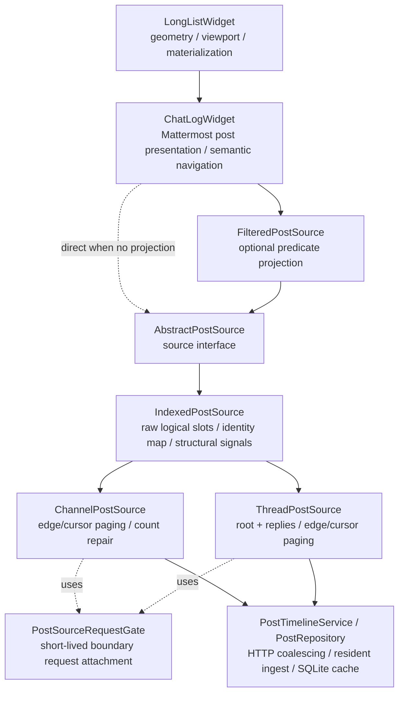

# Post sources: interface and indexing

> Part of [Post source architecture](../post-source-architecture.md). Read the landing page first and load this file only when this area is relevant.

## Layering



`ChatLogWidget` intentionally does not own `postIds`, page arithmetic or thread cursor state. Both
concrete sources expose the same logical contract through `AbstractPostSource`; common raw identity
bookkeeping lives in `IndexedPostSource`.

`FilteredPostSource` is an optional decorator above another `AbstractPostSource`. It owns a second,
filtered logical coordinate system, not transport truth. The wrapped source remains authoritative for
server paging, absolute/channel coordinates, count repair, cursor placement and permalink context.

`PostSourceRequestGate` is deliberately a small helper rather than another source base class. Channel
and thread sources share the mechanics of attaching adjacent logical demand to one exact in-flight
boundary request, but they do **not** share enough count/boundary semantics to justify hiding their
transport policy behind inheritance.

## `AbstractPostSource`: interface only

`AbstractPostSource` is deliberately small. It defines what the view can ask of a logical sequence:

```cpp
itemCount();
isAvailable(index);
postAt(index);
postIdAt(index);
indexOfPost(postId);
ensurePostIndex(postId);
isAuthoritativeRow(index);
authoritativeItemCount();
isPostPositionAuthoritative(postId);
wrappedSource();
authoritativeSource();
requestRange(first, last, reason, generation);
```

`postIdAt(index)` is intentionally independent of body residency. A source can therefore retain
semantic identity while the corresponding `BackendPost` body is evicted, and decorators can preserve
policy decisions without confusing "not resident" with "unknown identity".

The authority metadata is also view-facing rather than transport-specific. Ordinary server sources and
predicate projections report every row as authoritative. An additive local decorator such as the outbox
marks its local tail non-authoritative and reports only the wrapped prefix in
`authoritativeItemCount()`. `isPostPositionAuthoritative(postId)` is a separate question: for
example a thread target can be a real server post whose logical position is still provisional.
Decorators delegate that question to the wrapped source.

Presentation decorators also expose their wrapped source through the common
`wrappedSource()` contract. `authoritativeSource()` traverses that chain to the
innermost topology-owning source. Semantic operations that belong to server
topology—permalink context adoption, thread navigation readiness, future
transport-specific operations—must use this contract rather than hard-coding
knowledge of `FilteredPostSource`, `OutboxPostSource`, or decorator ordering.
Adding another presentation layer must not make navigation conditionally fail.

The structural/data signals consumed by `ChatLogWidget` are:

```text
itemCountChanged(count)
itemsInserted(first, count)
itemsRemoved(first, count)
rangeAvailable(first, last)
bodyAvailabilityChanged(first, last, available)
seekTargetResolved(index, generation)
layoutChanged(first, last)
rangeRequestFinished(first, last)
```

It contains no Mattermost paging policy and no storage container. This keeps alternate future post
sources possible without inheriting channel/thread assumptions.

### Structural-signal discipline

`layoutChanged` is deliberately dangerous and must be treated as a last resort, not as a generic
"something changed" notification.

The default choices are narrow and exact:

- content/presentation state changed in place -> update the concrete widget/model data directly;
- item height may have changed -> child `dimensionsChanged` / `LongListWidget::itemsChanged`;
- known insertion/removal -> `itemsInserted` / `itemsRemoved`;
- body became resident/non-resident -> `rangeAvailable` / `bodyAvailabilityChanged`;
- one logical row changes identity without changing list cardinality -> use a dedicated replacement
  transaction/signal owned by that feature;
- only a genuine already-existing identity-to-index remap that cannot be represented by the above may
  emit `layoutChanged`.

Do **not** emit `layoutChanged` for delivery-state transitions, ordinary appends, optimistic
confirmation, reaction/body updates, or as a convenient way to force remeasurement.

This rule exists because broad remap/reconciliation used as a refresh mechanism has previously caused
content-height collapse/regrowth, extra anchor corrections, permalink/viewport lock loss, flicker and
wheel-scroll jitter. The desired invariant is: **same semantic item => same QWidget**, except for an
explicit narrow identity replacement, and one logical mutation => one geometry transaction.

Any new `layoutChanged` producer requires a focused regression test proving that surviving semantic
widgets are retained and that ordinary anchors, sticky bottom, viewport locks and wheel scrolling do
not jump. Source implementations call the deliberately named `mappingChanged()` helper for this;
there is no generic `itemsChanged()` compatibility shim. Body edits, reactions, tombstones and
duplicate live delivery must update the existing model/widget in place and must not have a path to
`layoutChanged`.

`rangeRequested(first,last,...)` is **logical demand**, not an instruction to perform one HTTP request
per fixed-size block. For ordinary viewport/prefetch work `LongListWidget` may request one contiguous
missing range spanning the whole desired window. The concrete source decides whether that demand is
best satisfied by an edge bootstrap, an exact cursor walk, an in-flight attachment, or a disconnected
seek.

## `IndexedPostSource`: shared logical identity space

Both current Mattermost sources maintain the same fundamental structures:

```cpp
QVector<QString> postIds;        // logical index -> post id; empty means unavailable
QHash<QString, int> postIndexes; // post id -> current logical index
BackendChannel& channel;         // resident identity -> BackendPost resolution
```

`IndexedPostSource` owns these structures and implements:

- `itemCount()`;
- `isAvailable()`;
- `postAt()`;
- `indexOfPost()`;
- rebuilding the reverse identity map;
- exact-window identity assignment;
- duplicate relocation when an authoritative window moves a previously provisional identity;
- no-op suppression when an already-known window is fetched again;
- tail resize;
- insertion of empty logical slots;
- structural slot removal.

It still does **not** know why a window is exact, which side of a sequence is authoritative, or which
network request produced it.

### Exact-window mutation

Concrete sources first establish positional authority, then hand the identity mutation to the base:

```text
source proves: IDs A B C belong at logical [17..19]
        |
        v
assignExactWindow(17, [A,B,C])
        |
        +-- clear old occurrences of A/B/C elsewhere
        +-- write A/B/C into [17..19]
        +-- rebuild postIndexes
        +-- report concrete identities that were replaced/cleared
        |
        v
publishExactWindow(...)
        |
        +-- itemsChanged only for previously concrete rows that changed
        +-- rangeAvailable for newly authoritative/available window
```

Fetching an identical page twice currently produces no source signals. This matters because
`rangeAvailable` and `itemsChanged` both schedule list synchronization; emitting them for an identity
no-op can turn a boundary mismatch into a tight repeat-request loop.

This identity no-op rule must remain separate from future resident-body availability. Once Phase 3 can
evict a `BackendPost` while retaining its source ID, rematerializing that same ID must publish
"resident body available again" even though the logical identity mapping did not change. That path
should be an explicit availability/rematerialization notification, not a fake identity mutation.

An empty string remains an **unavailable logical slot**, not a fake post and not a widget placeholder.
Only `LongListWidget` owns its estimated pixel height.

### Structural mutation

There are three generic structural primitives:

```text
resizeLogicalTail(newCount)
    changes only the newest/tail side and emits itemCountChanged

insertEmptyLogicalSlots(first, count)
    shifts existing logical identities right and emits itemsInserted

eraseLogicalSlots(first, count)
    removes logical identities, shifts later identities left and emits itemsRemoved
```

The base does not choose which primitive a count correction requires. That is topology-specific.
