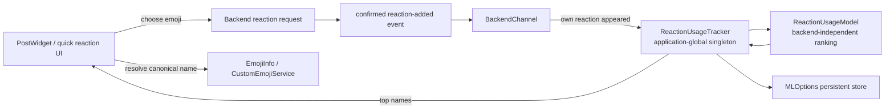

# Reaction quick bar and popularity ranking

MatterLeast keeps one small application-wide reaction ranking. The quick bar is derived entirely from that ranking; there is no separate favorites/default-favorites model.

The ranking stores canonical Mattermost emoji names only, for example `fire`, `heart` or a custom name. Resolution to Unicode or a custom image belongs to `EmojiInfo` / `CustomEmojiService`.

## Startup seed

A completely empty profile would otherwise have no quick reactions. When persisted ranking state is empty, `ReactionUsageTracker` seeds the model with a deliberately weak generic prior:

```text
:+1:
:fire:
:heart:
```

Each seed starts with:

```text
count = 1
heat  = 0.5
```

The seeded model is persisted immediately. Seeds are not special after initialization: a real successful reaction reheats to `1.0`, and normal cooling/trimming can eventually evict every seed. Existing non-empty user history is never supplemented or overwritten by the seed list.

## Architecture



`ReactionUsageModel` contains no `Backend`, network, channel or server identity. It only knows reaction names and ranking values.

`ReactionUsageTracker` owns the sixteen-entry model and persists it through `MLOptions`.

`BackendChannel` records usage only after the post model confirms that the logged-in user's reaction was actually added. The ranking therefore describes successful behavior rather than button clicks.

## What counts as a use

A reaction is recorded only for this transition:

```text
our reaction absent -> reaction-added update -> our reaction present
```

These do not increase popularity:

- clicking a reaction that removes an already-present reaction;
- another user's reaction;
- duplicate/replayed reaction-added updates;
- a failed request that never appears in the post model.

## Ranking state

Each retained entry has:

```text
name   canonical Mattermost emoji name
count  bounded familiarity score
heat   recency score in (0, 1]
```

Only the sixteen hottest entries are retained.

Ranking order is:

1. higher `heat`;
2. higher `count` when heat is equal;
3. emoji name as a deterministic final tie-break.

### Cooling

On every successful reaction use, existing entries cool first:

```text
h' = h * exp(-0.5 / sqrt(c))
```

where `h` is current heat and `c` is effective count.

The selected reaction then becomes:

```text
count = count + 1
heat  = 1.0
```

A newly seen real reaction starts at `count=1, heat=1.0`.

The approximate half-life of an untouched entry is:

```text
T_half ~= 1.386 * sqrt(c)
```

so repeated habits cool more slowly than one-off reactions without becoming permanent.

### Count aging

`count` is not lifetime telemetry. When any retained count reaches:

```text
CountAgingThreshold = 128
```

all retained counts are aged together:

```text
count = ceil(count / 2)
```

Heat is unchanged. Aging repeats for malformed/legacy persisted data until every count is below the threshold.

## Persistence

The ranking is stored under:

```text
reaction_usage/popularity_v1
```

as compact JSON:

```json
[
  {"name":"fire","count":"23","heat":0.82},
  {"name":"eyes","count":"7","heat":0.61}
]
```

On restore the model discards invalid entries, merges duplicate names conservatively, applies count aging and keeps only the sixteen hottest entries.

## Quick-bar composition

Hovering the reaction affordance shows at most the eight hottest **renderable** names from the ranking.

There is no second favorites source and no overlap/deduplication policy to maintain.

If a ranked custom emoji is not yet available locally, that name is omitted from the current popup while the shared custom-emoji resolver is allowed to fetch it. Other ranked reactions still render normally.

Clicking the heart affordance itself continues to open the complete emoji chooser.

### Composer hover palette

Hovering the composer's emoji-picker button uses the same sixteen-entry ranking,
but it does not open or enumerate the full picker. Only the currently ranked
names are resolved.

The hover palette shows up to sixteen **renderable** ranked emoji in ranking
order, laid out row-major as two rows of up to eight buttons. It is positioned
above the picker affordance and centered over that button when the available
window geometry permits.

The palette surface uses the application's `QPalette::Base` role, matching the
chat background without copying palette state from a specific chat widget. Its
rounded one-pixel outline uses `QPalette::Mid`, which keeps the popup distinct
from both the chat surface and the adjacent composer surface in light and dark
themes. The existing compact inner padding is intentional.

Selecting one of these buttons inserts its `:name:` shortcode into the
composer. Clicking the picker affordance itself remains unchanged and opens the
complete emoji chooser.

An unresolved ranked custom emoji is omitted from the current palette while the
shared lazy resolver fetches it. If it becomes available while the palette is
still open, the small ranked palette is rebuilt; the full custom catalog is
never enumerated for this hover path.

## Custom emoji prewarm

After successful login, MatterLeast prewarms only the hottest ten names from the current ranking:

```text
ReactionUsageTracker::topNames(10)
    -> EmojiInfo::findByName(name)
```

Built-in names resolve synchronously and cause no network request. Unknown custom names trigger the existing lazy `CustomEmojiService` lookup and disk cache.

MatterLeast deliberately does **not** enumerate the server custom-emoji catalog or download the first page at startup. A custom image is fetched because it is actually needed by one of these paths:

- a ranked reaction is prewarmed after login;
- a message/reaction references an unknown custom name;
- the emoji picker server search returns that custom emoji.

The ranking stores names only; it never owns images, paths or backend pointers.

## Implementation files

```text
sources/reactions/ReactionUsage.h
    pure ranking, seed policy, cooling, count aging and serialization

sources/reactions/ReactionUsageTracker.{h,cpp}
    process-wide singleton, persistence and empty-ranking seeding

sources/backend/types/BackendChannel.cpp
    confirmed-own-reaction integration point

sources/backend/Backend.cpp
    post-login ranked-name prewarm

sources/chat-area/post/reactions/ReactionQuickBarController.cpp
    top-eight reaction popup

sources/chat-area/outgoing-post/OutgoingPostCreator.cpp
    two-row top-sixteen composer hover palette

sources/ui/RankedEmojiPresentation.{h,cpp}
    shared built-in/custom ranked-emoji rendering without catalog enumeration

tests/EmojiDialogSupportTest.cpp
    ranking, seeding, aging and persistence tests
```

## Invariants

Future changes should preserve these rules:

- there is one popularity model; do not reintroduce a parallel favorites model;
- the ranking model stays backend-independent;
- only a confirmed newly-added own reaction counts as usage;
- a real use must outrank the weak startup seed immediately;
- familiarity may slow cooling but remains bounded;
- only a bounded sixteen-entry set of names is persisted;
- startup and hover network work is proportional to the small ranked working set, not the size of the server custom-emoji catalog;
- composer hover must read only the bounded ranking and must not enumerate picker categories or the custom-emoji catalog;
- unresolvable custom emoji must not block standard quick reactions.
