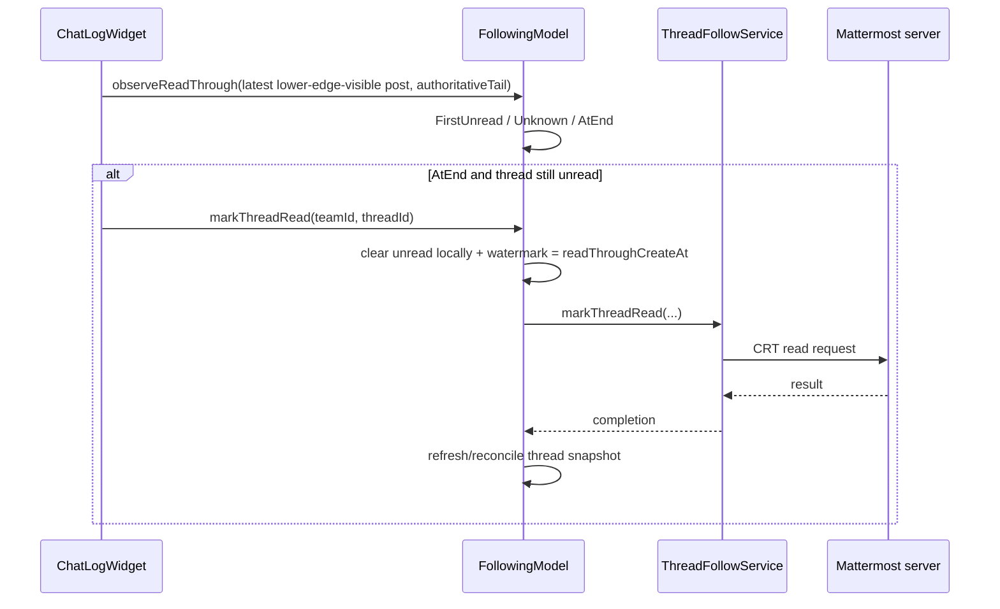
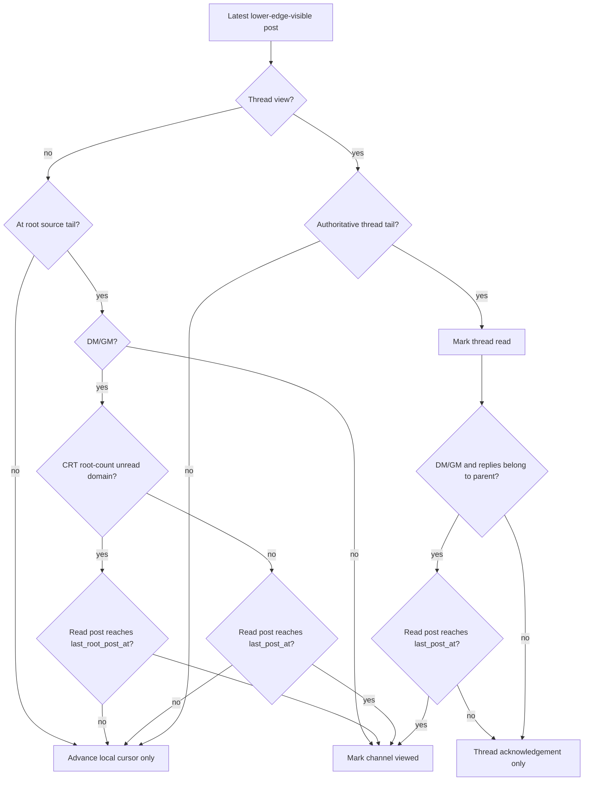

# Read tracking: projections and server acknowledgement

> Part of [Following, Attention and read tracking](../following-attention-read-tracking.md). Read the landing page first and load this file only when this area is relevant.

## Following and Attention are projections, not read engines

The complete Following queue/activation contract lives in
[Following behavior](../following.md). This document owns only the read-state and
server-acknowledgement aspects shared with Attention.

Both views use the same `FollowingModel::Entry` objects and therefore the same
`ResumeState`, `firstUnreadPostId`, and read-through boundary.

Following is the broader queue. It contains followed threads and unread direct /
group conversations represented by the model. Attention filters that same model
to entries for which `requiresAttention()` is true.

The activation path may choose a destination from the cursor:

```text
FirstUnread -> navigate to firstUnreadPostId
AtEnd       -> present the conversation/thread
Unknown     -> ask the server/current model for a useful resume target
```

That cursor lookup applies when entering/re-entering a semantic destination.
Repeated activation of the same Following/Attention **conversation** row while
that channel is already the active channel is presentation-only: it must keep the
current viewport rather than reinterpret the same row as a "next unread" button.
If the user leaves the channel and activates the row again, the current resume
cursor is resolved normally. Followed-thread navigation keeps its existing resume
semantics because a thread is an ordered unread-reply domain of its own.

The activation path must not clear unread counters or synthetic mention entries.
A selected row may be retained temporarily so the item does not disappear under
the pointer while the model refreshes; retention is UI-only and must not create
an independent read state.

This is an important invariant: **Following and Attention must never differ in
what counts as read.** If clicking the same semantic entry in one projection
changes unread state while the other does not, the implementation is wrong.

## Thread snapshot refresh policy

`FollowingModel` keeps a shared server snapshot of followed CRT threads. Refreshing
that snapshot is not free: `ThreadFollowService::queryFollowingThreads()` first
requests the normal followed page and then requests the authoritative unread
snapshot before merging them. A refresh therefore normally means at least two
HTTP requests per team.

The 300 ms `threadRefreshTimer_` is a **single-shot debounce**, not a periodic
polling timer. It should only be scheduled when an event can make the CRT snapshot
stale, for example:

- initial/team population or WebSocket reconnect;
- follow/unfollow membership changes;
- incoming thread replies or root mentions that may affect Following/Attention;
- completion/failure of an explicit CRT read acknowledgement that needs server
  reconciliation.

Ordinary channel acknowledgement is deliberately different. `Backend::onChannelViewed`
updates channel unread state through `SidebarService`; `FollowingModel` can also
remove synthetic root-mention entries and resynchronize DM/GM conversation rows
entirely from local state. Viewing a channel does **not** change followed-thread
membership and must not schedule a full CRT snapshot refresh merely because the
channel became read.

```text
channel viewed
    -> clear synthetic mentions for that channel
    -> sync local DM/GM conversation projection
    -> emit changed
    -> no queryFollowingThreads()
```

If a future event handler schedules a refresh, it should be because the thread
snapshot itself may have changed, not as a generic way to make the sidebar catch
up after any read-state event.

## Thread end and server acknowledgement

A followed thread can only be considered fully read when the lower-edge cursor
reaches its real newest post. For `ThreadPostSource`, being at the last logical
index is not enough while navigation placement is provisional. The last post
must also have an authoritative source position:

```text
read post is source itemCount - 1
AND
ThreadPostSource::isPostPositionAuthoritative(readPost.id)
```

When that condition is true, `observeReadThrough()` reaches `AtEnd`. If the
thread still carries unread replies/mentions, `FollowingModel::markThreadRead()`
performs the Mattermost CRT acknowledgement. The model clears the local unread
state optimistically and uses `readAcknowledgementPending` /
`readAcknowledgementAt` while reconciling the following thread snapshot.

The acknowledgement watermark is a **server-timeline post boundary**. It is taken
from the `readThroughCreateAt` of the authoritative tail that was actually read
(with the entry's server `lastReplyAt` only as a defensive fallback). It must not
be based on the client's wall clock: CRT snapshots compare their server
`lastReplyAt` against this watermark, and even small client/server clock skew
would otherwise make a stale snapshot look like a genuinely newer reply and
resurrect an already-read Attention item.

A stale snapshot at or before the acknowledgement boundary must therefore not
resurrect unread state, while a reply with a later server post timestamp must.



## Channel end and server acknowledgement

Normal channel timelines use the same lower-edge cursor. When the cursor reaches
the logical tail of the root-post source, the channel is locally marked viewed
through `SidebarService` and acknowledged to the server through
`Backend::markChannelAsViewed()`.

Direct and group conversations follow the same unread domain selected by
`ChannelActivityTracker`. With Collapsed Reply Threads enabled *and* both
membership/channel root counters available, the parent conversation contains
root posts only for unread/resume purposes. A hidden reply belongs to its thread
entry and must not keep the parent DM/GM unread. The main root source therefore
uses `last_root_post_at` as its acknowledgement watermark; reading a thread
advances/acknowledges only that thread.

When CRT is disabled, or root counters are unavailable, replies still belong to
the parent channel unread domain. In that compatibility mode DM/GM keeps the
whole-conversation rule: the acknowledgement watermark is `last_post_at`, and
reading the actual newest reply may also consume the conversation-level unread
state.



## Events that trigger re-evaluation

The read cursor should be re-evaluated whenever geometry or semantic source state
can make a different lower edge visible. `ChatLogWidget` currently schedules an
update from visible-range changes, materialized-range changes, user viewport
changes, source insert/remove/range/body changes, post geometry changes, and
navigation finalization. Showing or re-presenting an already-open view may also
request one re-evaluation so a viewport that is already at the tail is not missed.

A live append while sticky-bottom is active is specifically covered by this rule:
logical tail growth, concrete row materialization, and final measured geometry
must result in a re-evaluation after the bottom anchor has been restored. No user
input event is required after the append.

These are **triggers to inspect the viewport**, not proof of reading. The geometry
rule remains the only proof.

## Synthetic root mentions

A root post that mentions the current user can temporarily appear as a synthetic
thread-shaped Following/Attention entry before the shared thread snapshot has a
real CRT object for it. Synthetic entries obey the same rule as every other
entry: clicking one only navigates to the post. It must not be consumed on click.
Once the containing channel is genuinely acknowledged as viewed, local model
reconciliation removes the synthetic mention without requiring a full followed-
thread refetch.

## Invariants for future changes

Do not add a second read state machine around navigation. In particular:

- do not mark a post/channel/thread read because an item was clicked;
- do not mark it read because navigation or highlighting succeeded;
- do not treat materialization by itself as reading;
- do not use `isAtEnd()` alone as a substitute for checking the concrete newest
  post lower edge;
- when sticky-bottom was active before a live tail append, preserve bottom through
  logical growth and real-height measurement, then re-evaluate the new concrete
  tail; if its lower edge is in the viewport, it is read without another gesture;
- do not add per-Following or per-Attention **read** state; presentation-only
  selection/last-activated identity is allowed only to distinguish a repeated
  click from entering/re-entering a semantic destination;
- do not add `explicitReadPending`, `threadReadPending`, or equivalent navigation
  intent flags to decide whether viewport content counts as read;
- do not let back-scrolling regress the semantic high-water mark;
- do not convert a missing cached next-post identity into `AtEnd` unless the
  source tail is proven;
- keep read identity semantic (`create_at`, `id`), not tied to a provisional
  logical index;
- compare CRT acknowledgement/snapshot ordering only on the server post timeline;
  never compare server `create_at` / `lastReplyAt` values with client wall-clock
  time;
- do not use `onChannelViewed` as a generic trigger for a full followed-thread
  snapshot; local channel read projection and CRT snapshot freshness are separate
  concerns;
- put changes to the read definition in `ChatLogWidget` and changes to resume /
  shared projection state in `FollowingModel`, rather than duplicating logic in
  sidebar views.

If future behavior conflicts with this document, either the code is a regression
or this contract must be deliberately changed in the same PR.
