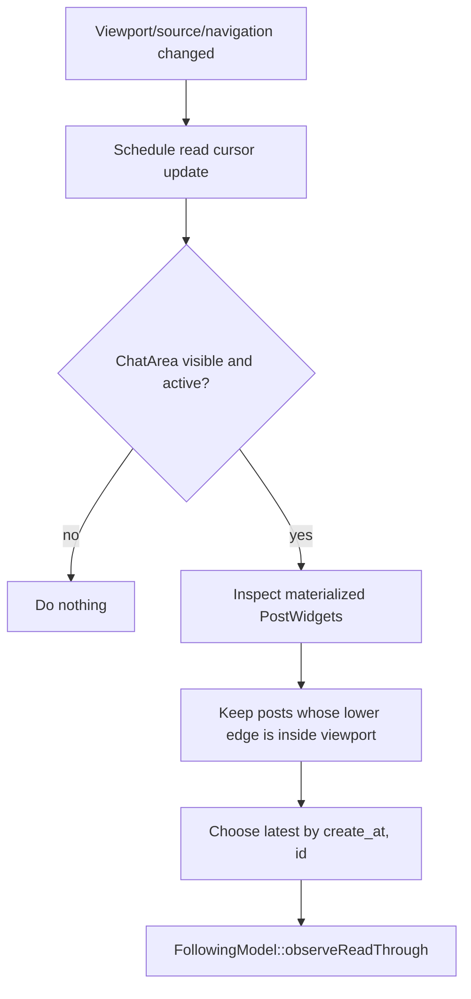
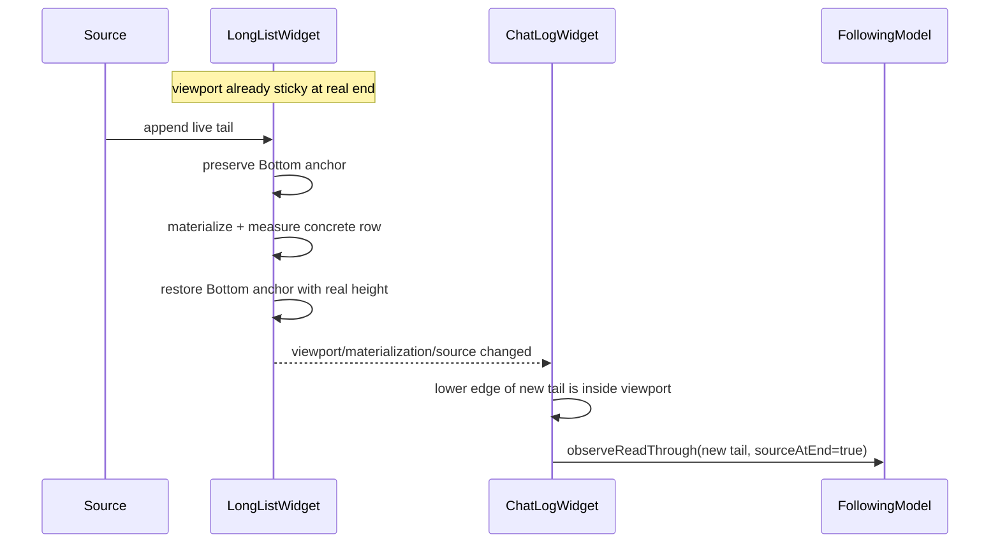
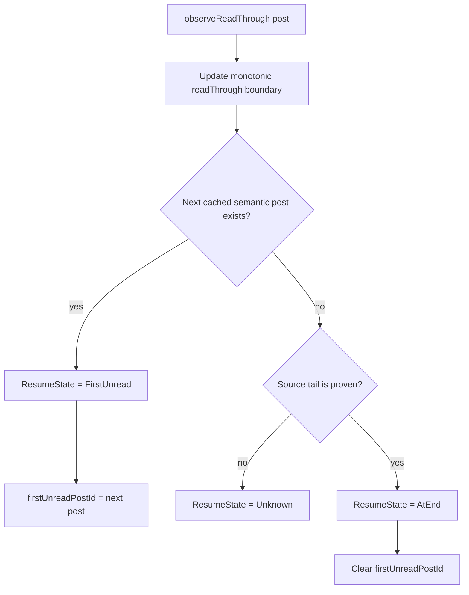

# Read tracking: scrolling and resume cursor

> Part of [Following, Attention and read tracking](../following-attention-read-tracking.md). Read the landing page first and load this file only when this area is relevant.

## Components and ownership

`FollowingModel` is the single semantic model behind both sidebar projections.
`ChannelQuickList` renders the Following view and `AttentionList` renders the
subset that currently requires attention. The views own only presentation state
such as selection retention and sorting.

Read progress belongs to the timeline and shared model:

- `ChatLogWidget` observes the concrete viewport and determines the newest post
  that the user has actually read.
- `FollowingModel` owns the monotonic semantic resume cursor for entries shown in
  Following/Attention.
- `SidebarService` owns channel unread/mention state.
- `ThreadFollowService` owns the server operation that acknowledges a collapsed
  reply thread (CRT) as read.
- `ChannelQuickList` and `AttentionList` navigate to model state; they must not
  mutate read state merely because an item was clicked.

The relevant implementation files are:

- `sources/chat-area/ChatLogWidget.cpp`
- `sources/backend/FollowingModel.{h,cpp}`
- `sources/channel-tree/ChannelQuickList.cpp`
- `sources/channel-tree/AttentionList.cpp`
- `sources/chat-area/ThreadPostSource.{h,cpp}`
- `sources/backend/SidebarService.{h,cpp}`
- `sources/backend/ThreadFollowService.{h,cpp}`

For the underlying virtualized list and thread source contracts, also see
[`long-list-architecture.md`](long-list-architecture.md) and
[`thread-timeline-loading.md`](thread-timeline-loading.md).

## One read rule for every scrolling mechanism

`ChatLogWidget::updateReadCursorFromViewport()` is the canonical place where
visible timeline geometry becomes read progress. It is scheduled after viewport,
materialization, source, and navigation changes. Consequently wheel scrolling,
scrollbar dragging/clicking, keyboard scrolling, and programmatic positioning all
converge on the same geometry check.

For every materialized post widget, the lower edge is:

```text
bottom = widget.y + widget.height
```

The post qualifies as read only when:

```text
0 < bottom <= viewport.height
```

A tall message whose upper part is visible but whose lower edge is still below
the viewport is therefore **not** read. This is intentional and must not be
weakened to “the item is visible” or “the item is materialized”.

Among all posts satisfying the lower-edge condition, `ChatLogWidget` chooses the
latest semantic post by `(create_at, id)`. The logical list index is useful for
source-tail checks, but it is not the durable read identity.



## Live tail while sticky-bottom is active

An incoming post is not special-cased as read merely because it arrived while a
chat was open. The same lower-edge rule still applies. However, sticky-bottom has
an important consequence that must be preserved explicitly.

If the viewport was already at the real end before a live tail item was appended,
`LongListWidget` preserves the bottom anchor across logical growth,
materialization, and the later replacement of estimated height by the concrete
row height. Once that transaction settles, the new tail's lower edge is at the
bottom of the viewport. It therefore satisfies the normal read rule immediately,
without requiring an extra wheel/scrollbar gesture from the user.

This is true even for a post taller than the viewport. Sticky-bottom aligns the
**bottom** of that oversized post with the viewport bottom, so its lower edge has
been seen and the post is read. By contrast, navigating to the beginning of the
same oversized post does not qualify until the user reaches its lower edge.



If the user was **not** sticky at the end before the append, arrival of the new
post must not move the read cursor to it. The live item remains unread until its
lower edge actually enters the viewport later.

## The monotonic resume cursor

An entry represented by `FollowingModel` keeps a semantic high-water mark:

```text
readThroughCreateAt
readThroughPostId
```

`FollowingModel::observeReadThrough()` never moves this boundary backwards. If
the user scrolls back to older messages, the saved read-through point remains at
the newest post previously proven read.

After advancing the boundary, the model searches the cached conversation/thread
for the first semantic post after it:



`FirstUnread` is the resume target when Following/Attention enters or re-enters
that semantic destination. It is **not** a "next unread" command for repeated
clicks on an already-open conversation row; that presentation-only case preserves
the current viewport. `Unknown` means the local cache has no next identity but
the source has not proved that the read post is the real tail; guessing “read”
here is not allowed. `AtEnd` means the real tail has been consumed.
